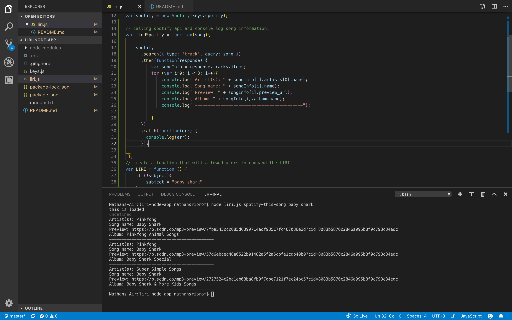
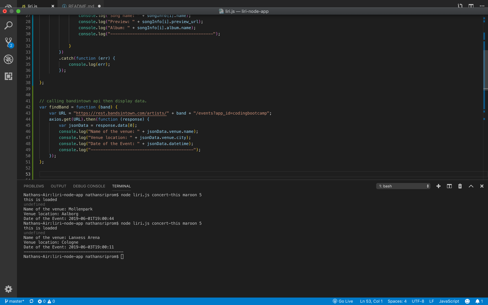
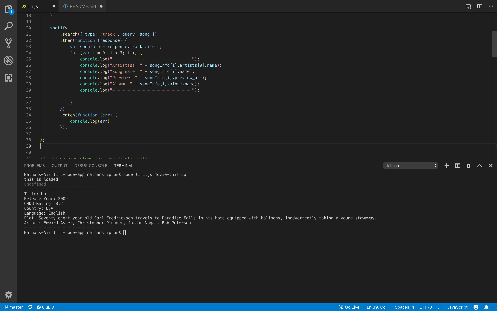
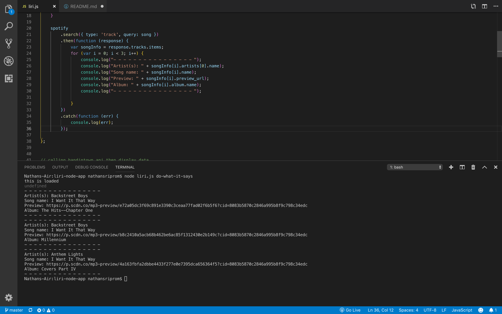

# LIRI
LIRI will search Spotify for songs, Bands in Town for concerts, and OMDB for movies.

[Link to Video Demo](https://drive.google.com/file/d/12o_4k8mGg8DtYfhgIGzI77mmy_tzH1tR/view)

liri.js can take in one of the following commands:

# Spotify
spotify-this-song

# Band in Town
concert-this

# Movie IMDB 
movie-this

# Do what it says
do-what-it-says

